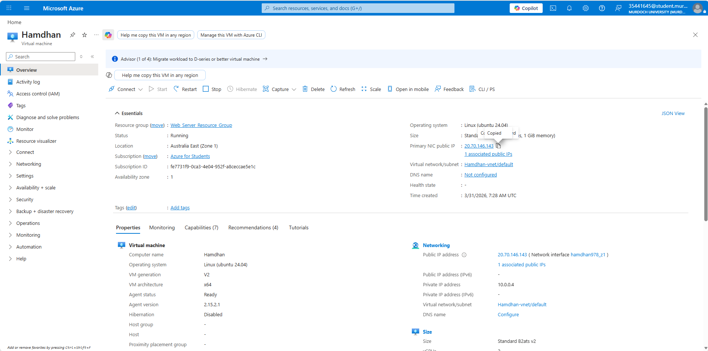
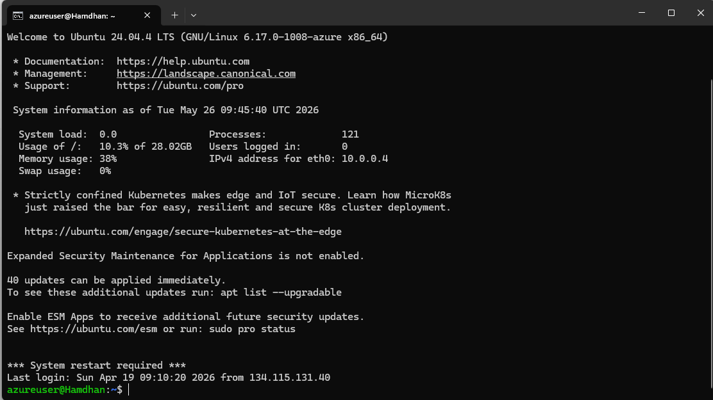
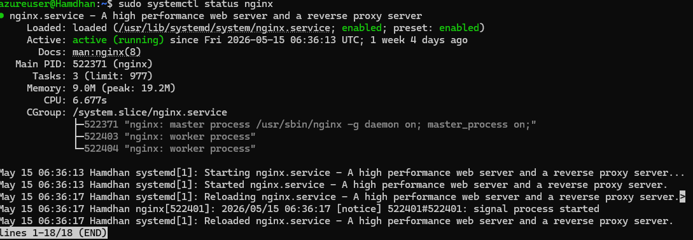
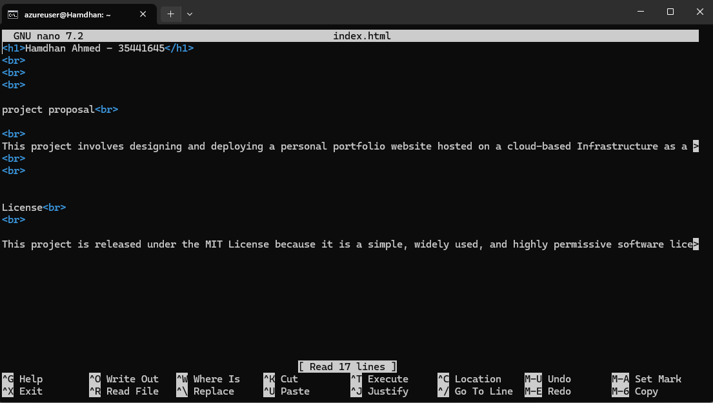
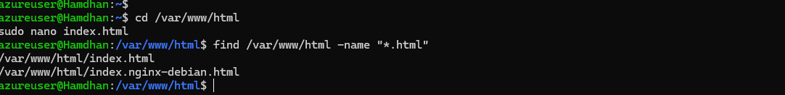
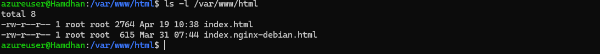
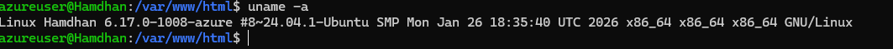
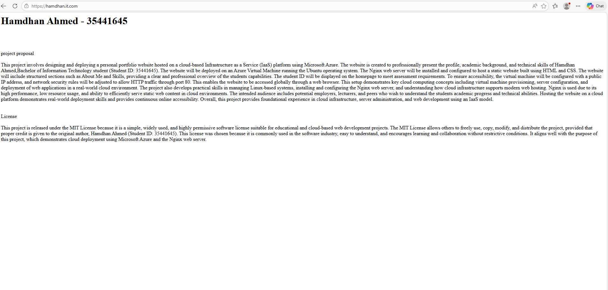

# ICT171 Cloud Server Project

## Student Details

**Name:** Hamdhan Ahmed  
**Student ID:** 35441645  
**GitHub Repository:** https://github.com/Hamdhan833/ICT171-Cloud-Server-Project  
**Website:** https://hamdhan.it.com/  
**Public IP Address:** 20.70.146.143  

## Project Overview

This project documents the design and deployment of a personal portfolio website hosted on a Microsoft Azure Virtual Machine using Ubuntu Linux and the Nginx web server. The website presents my academic background, technical skills, and personal profile as a Bachelor of Information Technology student.

The project demonstrates cloud server deployment, Linux server administration, web server configuration, DNS setup, HTTPS configuration, and basic scripting.

## Azure Virtual Machine Deployment

The cloud server for this project was deployed using Microsoft Azure Infrastructure as a Service (IaaS). An Ubuntu Linux Virtual Machine was created and configured to host the portfolio website.

### Azure Configuration

- Cloud Platform: Microsoft Azure
- Virtual Machine Type: Ubuntu Linux VM
- Public IP Address: 20.70.146.143
- Domain Name: https://hamdhan.it.com/
- Remote Access Method: SSH
- Web Server: Nginx

## Server Build Process

The following steps were used to deploy and configure the cloud server.

### Step 1 – Create the Azure Virtual Machine

1. Logged into the Microsoft Azure Portal.
2. Created a new Ubuntu Linux Virtual Machine named **Hamdhan**.
3. Assigned a public IP address.
4. Configured inbound network rules to allow HTTP (Port 80) and HTTPS (Port 443) traffic.
5. Deployed the virtual machine and verified that it was running.

### Step 2 – Connect to the Server Using SSH

The server was remotely administered using SSH.

```bash
ssh azureuser@20.70.146.143
```

SSH access allowed Linux commands to be executed directly on the Azure Virtual Machine.

### Step 3 – Update the Ubuntu Server

The following commands were used to update the operating system packages:

```bash
sudo apt update
sudo apt upgrade -y
```

This ensured that the server was running the latest available software and security updates.

### Step 4 – Install and Configure Nginx

Nginx was installed using the following command:

```bash
sudo apt install nginx
```

The Nginx service was verified using:

```bash
sudo systemctl status nginx
```

### Step 5 – Deploy the Website Files

The website files were stored inside the Nginx web root directory:

```bash
cd /var/www/html
```

The homepage was edited using:

```bash
sudo nano index.html
```

The website was developed using HTML and CSS and manually deployed to the server.

### Step 6 – Configure DNS

A custom domain name was configured to point to the Azure Virtual Machine public IP address:

```text
Domain: hamdhan.it.com
Public IP: 20.70.146.143
```

This allowed users to access the website using a domain name rather than the IP address.

### Step 7 – Enable HTTPS

HTTPS was enabled to provide encrypted communication between users and the web server.

The website can be securely accessed at:

```text
https://hamdhan.it.com/
```

### Step 8 – Verify Website Accessibility

The website was tested by:

- Accessing the website through the public domain name.
- Confirming HTTPS functionality.
- Verifying Nginx service status.
- Confirming that the website was publicly accessible from a web browser.

### SSH Access

The following command was used to remotely connect to the Azure virtual machine:

```bash
ssh azureuser@20.70.146.143
```

### Updating Ubuntu Packages

The following commands were used to update the Ubuntu server:

```bash
sudo apt update
sudo apt upgrade -y
```

### Installing Nginx

Nginx was installed to host the portfolio website:

```bash
sudo apt install nginx
```

### Checking Nginx Status

```bash
sudo systemctl status nginx
```

### Editing Website Files

The website files were stored inside the `/var/www/html/` directory.

```bash
cd /var/www/html
sudo nano index.html
```

## DNS Configuration

A custom domain name was configured to allow global access to the hosted website.

### Domain Information

- Domain Name: https://hamdhan.it.com/
- Public IP Address: 20.70.146.143

DNS records were configured to point the domain name to the Azure virtual machine public IP address.

This allowed users to access the website through a web browser using a user-friendly domain name instead of directly using the IP address.

## HTTPS / SSL Configuration

HTTPS was enabled to provide secure communication between the client browser and the web server.

SSL/TLS encryption helps protect user connections and improves website security.

The website can be securely accessed using:

```text
https://hamdhan.it.com/
```

The HTTPS configuration ensures encrypted communication between users and the hosted Azure server.

## Linux Server Maintenance Script

A simple Bash script was created to automate Ubuntu package updates and system maintenance.

### Script Purpose

This script automatically:
- updates package lists
- upgrades installed packages
- helps maintain server security and stability

### Script File

```bash
#!/bin/bash

sudo apt update
sudo apt upgrade -y
```

### Running the Script

The following commands were used to make the script executable and run it:

```bash
chmod +x update_server.sh
./update_server.sh
```

This scripting component demonstrates basic Linux server automation and administration skills.

## Website Overview

This project involved the design and deployment of a personal portfolio website hosted on a Microsoft Azure Virtual Machine using Ubuntu Linux and the Nginx web server.

The website was developed to professionally present:

- personal profile information
- academic background
- technical skills
- cloud computing experience

The website includes structured sections such as:

- Home
- About Me
- Skills
- Contact Information

The student ID is displayed on the homepage to satisfy assignment requirements.

The website was developed using HTML and CSS and deployed manually to the Azure cloud server using Linux command-line administration techniques.

## Project Objectives

The objectives of this project were to:

- deploy a cloud-based Infrastructure as a Service (IaaS) server
- configure a Linux server environment
- install and configure the Nginx web server
- host a publicly accessible website
- configure DNS and HTTPS
- develop Linux administration skills
- document the deployment process using GitHub

This project demonstrates practical cloud infrastructure deployment and server administration skills using Microsoft Azure.


## Project Screenshots

### Azure Virtual Machine Dashboard



### SSH Remote Access



### Nginx Web Server Status



### Website File Editing



### Linux File Searching



### Linux File Permissions



### Ubuntu System Information



### Final Website Deployment




## Challenges Faced

Several challenges were encountered during the deployment process including:

- configuring SSH remote access
- understanding Linux file permissions
- configuring DNS records
- enabling HTTPS functionality
- troubleshooting Nginx configuration issues

These challenges improved understanding of Linux server administration and cloud infrastructure deployment.


## Conclusion

This project successfully demonstrated the deployment and configuration of a cloud-hosted Linux web server using Microsoft Azure. The project provided practical experience with Ubuntu Linux, Nginx web hosting, DNS configuration, HTTPS implementation, and Linux server scripting.

The portfolio website was successfully deployed and made publicly accessible through a custom domain name.


## References

The following resources and lab guides were used during the development of this project:

1. Murdoch University Networking Labs – Linux Services  
https://github.com/SCH-IT-MurdochUni/NetworkingLabs/blob/main/Server_Environments_and_Architectures/linux_services.md

2. Murdoch University Networking Labs – Linux Permissions  
https://github.com/SCH-IT-MurdochUni/NetworkingLabs/blob/main/Reusable_Learning_Objects/linux_permissions.md

3. Murdoch University Networking Labs – Searching File Systems  
https://github.com/SCH-IT-MurdochUni/NetworkingLabs/blob/main/Reusable_Learning_Objects/searching_file_systems.md

4. Murdoch University Networking Labs – Create Your Cloud Server  
https://github.com/SCH-IT-MurdochUni/NetworkingLabs/blob/main/Server_Environments_and_Architectures/create_your_cloud_server.md

5. Murdoch University Networking Labs – DNS  
https://github.com/SCH-IT-MurdochUni/NetworkingLabs/blob/main/Server_Environments_and_Architectures/dns.md

6. Murdoch University Networking Labs – Let's Encrypt SSL Certificates  
https://github.com/SCH-IT-MurdochUni/NetworkingLabs/blob/main/Server_Environments_and_Architectures/obtaining_a_digital_certificate_from_lets_encrypt.md

7. Murdoch University Networking Labs – Linux Scripting  
https://github.com/SCH-IT-MurdochUni/NetworkingLabs/blob/main/Server_Environments_and_Architectures/scripting_linux_server_functions.md

8. Microsoft Learn – Create a Windows Virtual Machine in Azure  
https://learn.microsoft.com/en-gb/training/modules/create-windows-virtual-machine-in-azure/
